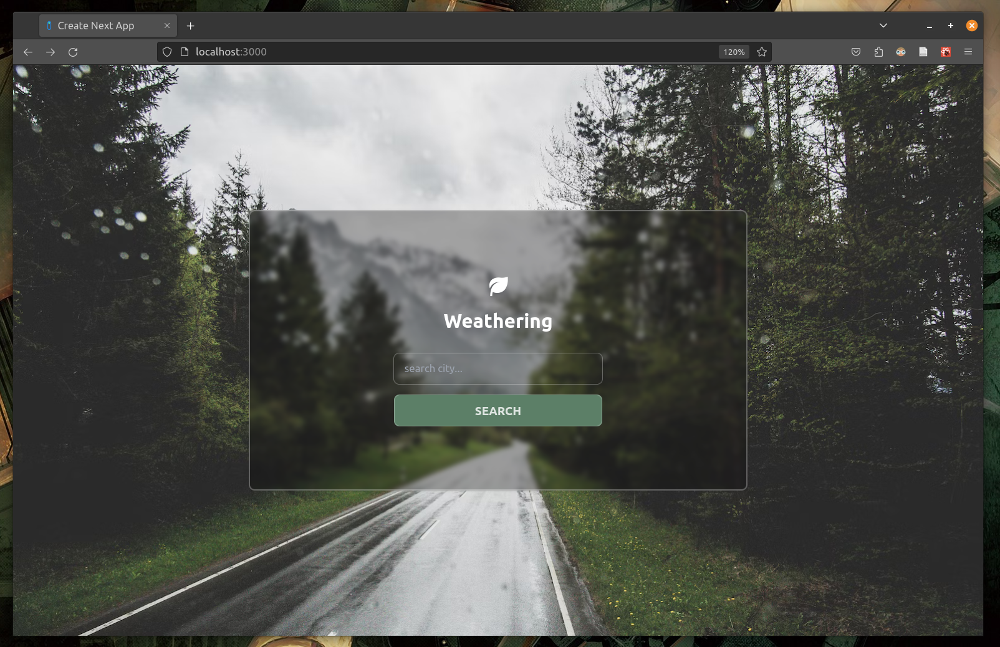
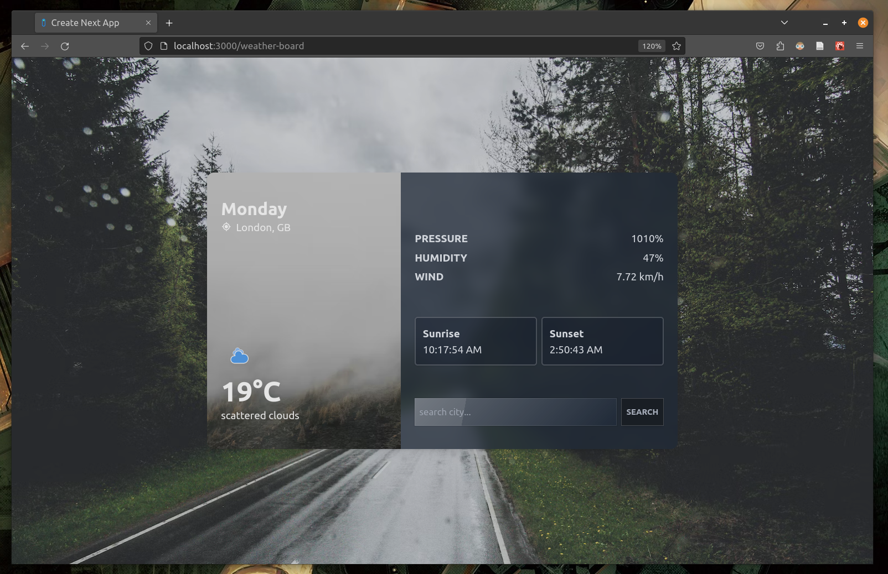

## Showcase





## Getting Started

First, run the development server:

```bash
npm run dev
# or
yarn dev
# or
pnpm dev
```

Add openweathemap api in the ```.env.local``` file,

```.env
NEXT_PUBLIC_WEATHER_API={key}
```


Open [http://localhost:3000](http://localhost:3000) with your browser to see the result.


## Tech Stack:

1. [Next JS]("https://nextjs.org/")
2. [Zustand]("https://github.com/pmndrs/zustand")
3. [DaisyUI]("https://daisyui.com/")
4. [React Toast]("https://www.npmjs.com/package/react-toastify")


I have opted in using the latest app router for this project, zustand is used for state management due to
context based state management libraries do not work properly with the new rsc and csc components, daisyUI
provides quick mockup by enabling us to write less tailwindCSS.


## Folder Structure

```
.
├── app
│   ├── favicon.ico
│   ├── globals.css
│   ├── layout.tsx
│   ├── page.tsx
│   ├── ReactQueryProvider.tsx
│   └── weather-board
│       └── page.tsx
├── components
│   ├── left.tsx
│   └── right.tsx
├── lib
│   └── api.ts
├── solid
│   └── solidCopy.tsx
└── store.ts

```


The app dir has a main ```page.tsx``` which is a client component and a ```weather-board``` route hosting
the weather info page, the ```right.tsx``` and the ```left.tsx``` components are server side rendered.

I initially wanted to use tanstack query for fecting the api but it would be too complex for this app.
